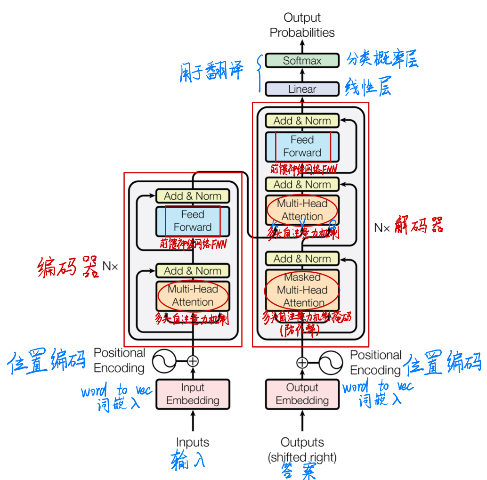

# Attention注意力模型（Transformer）

该模型的输入和输出遵循**相同尺寸**的原则，因此能无限层叠。
## 位置编码PositionalEncoding
**PositionalEncoding**是*Transformer*模型的前置模块。它帮助*Transformer*模型具有排列不变性，将输入的词向量带有了相对或者绝对位置的信息。  

位置编码需要满足三个核心约束：
1. 唯一位置标识：每个位置有唯一的编码向量
2. 相对位置表示能力：位置`pos+k`的编码可表示为`pos`编码的线性函数
3. 序列长度外推：能处理超过训练长度的序列  

这些约束直接指导了正弦编码的选择。关键在于：正弦函数满足`sin(A+B)=sinAcosB+cosBsinA`，使得相对位置信息可线性表示。
## Attention
**Attention**是*Transformer*模型的核心机制。Attention本质是一种“加权聚焦”机制，让模型在处理信息时能重点关注输入中与当前任务更相关的部分，计算公式则量化了这种相关性权重。它通过计算“查询（Query）”与“键（Key）”的相似度，给不同的“值（Value）”分配不同权重，最终输出加权后的信息。  

核心作用是解决传统模型处理长序列时“信息稀疏”的问题，让模型能动态捕捉输入中关键的依赖搞关系。
* **Q**：Query 查询矩阵，维度：**query_len**（查询数量） * **att_dim**（特征维度），每一行 *(seq_len)* 代表token
* **K**：Key 关键点矩阵，维度：**word_value**(键值对数量) * **att_dim**（特征维度）
* **V**：Value 价值矩阵，维度：**word_value**(键值对数量) * **value_dim**（值维度）
### 计算公式：$ Attention(Q, K, V) = softmax(\frac{Q*K^{T}}{\sqrt{d_{k}}}) * V$
1. 计算相似度：计算“查询（Query）”与“键（Key）”的相似度 $ Similarity = Q*K^{T} $，得到（seq_len, word_value）矩阵
2. 归一化权重：为稳定梯度，使用softmax函数计算缩放点积注意力 $ Attention Weights = Softmax(\frac{Similarity}{\sqrt{d_{k}}}) $，得到（seq_len, word_value）矩阵，其中 $ dim_{att} $ 是特征维度
3. 加权求和(输出)：用归一化后的权重对 V 加权，得到最终的 Attention 输出 $ Attention(Q, K, V) = Attention Weights × V $  
## Self-Attention
Self-Attention是Attention的一种特殊形式，核心是“查询、键、值来自同一输入”，即模型对自身输入序列内部的元素计算相关性。
## Cross-Attention
Cross-Attention是Attention的一种特殊形式，核心是“查询、键、值来自不同输入”，即模型对自身输入序列内部的元素计算相关性。其中，查询来自某一输入，键、值来自另一个输入。
