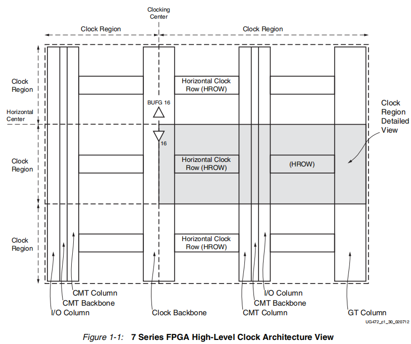

# FPGA 
## FPGA简介
**FPGA**（Field-Programmable Gate Array，即现场可编程门阵列），它是在PAL、GAL、CPLD等可编程逻辑器件基础上发展起来的一种新型可编程逻辑器件。它是作为专用集成电路（ASIC）领域中的一种版定制电路而出现，既解决了定制电路的不足，又克服了原有可编程器件门电路数量有限的缺点。FPGA器件内部集成了大量的逻辑单元（LE）、存储单元和可编程互连资源，用户可以根据需要通过硬件描述语言（HDL）编写逻辑功能，并将其下载到FPGA中，从而实现特定的数字电路功能。

|芯片|类型|运行过程|速度|结构|应用场景|开发语言|
|---|---|---|---|---|---|---|
|单片机|ASIC|串行运行|低速|哈佛架构、冯诺依曼架构|工业控制|C语言|
|FPGA|半定制电路|并行运行|高速|查找表LUT|算法实现、IC验证|Verilog、VHDL|

### FPGA的开发平台
Altera（现为英特尔FPGA）和Xilinx（现为赛灵思）是两大主流的FPGA开发平台，提供了丰富的开发工具和资源，支持设计人员进行FPGA的设计、仿真、综合和实现。
* Altera（英特尔FPGA）：提供**Quartus Prime**开发软件，支持多种FPGA器件系列，如Cyclone、Arria和Stratix等。
* Xilinx（赛灵思）：提供**Vivado**设计套件，支持多种FPGA器件系列，如Spartan、Artix、Kintex和Virtex等。

### FPGA的应用
1. 通信领域

	分布式的算法结构，高效地实现乘和累加操作

	基带处理（通道卡）、接口和连接功能以及RF（射频卡）三大类

2. 数字信号处理领域

	高速并行处理能力特别适合于完成FIR等滤波这样的重复性的数字信号处理任务

	灵活的高速I/O接口，适合于与各种高速模数转换器（ADC）和数模转换器（DAC）配合使用

3. 高速接口设计领域

	高速处理能力和多达成百上千个I/O口，适合于实现各种高速接口协议

4. 视频图像处理领域

	图像的压缩算法越来越复杂

	传统的ASSP或者DSP已经满足不了如此庞大的数据处理量

5. 人工智能领域

	主要应用于人工智能的前端部分，例如图像、语音等数据的预处理和特征提取

6. IC验证领域

	强大的布线布局资源

	灵活的可编程性

## 时序约束
时序约束（Timing Constraints）：用来描述设计人员对时序的要求，比如时钟频率，输入输出的延时等。
### 建立时间（Tsu：setup time）
是指在触发器的时钟信号上升沿到来**以前**，数据稳定不变的时间，如果建立时间不够，数据将不能在这个时钟上升沿被稳定的打入触发器，Tsu就是指这个最小的稳定时间。
### 保持时间（Th：hold time）
是指在触发器的时钟信号上升沿到来**以后**，数据稳定不变的时间，如果建立时间不够，数据同样不能被稳定的打入触发器，Th就是指这个最小的保持时间。
### 时序约束的作用
* 时钟频率过高（网口频率等等），去限制频率
* 工程逻辑资源过载，限制逻辑资源使用
* 添加无关紧要的功能后，导致工程不稳定，可能因为时序有问题导致的

## Verilog语言
### Verilog简介
Verilog是一种硬件描述语言（HDL），用于设计和描述数字电路的行为和结构。它允许设计人员使用类似于编程语言的语法来描述电路的功能和连接关系，从而实现数字系统的设计、仿真和综合。Verilog广泛应用于集成电路设计、FPGA开发和数字系统验证等领域。
### 基础知识
#### 逻辑值
Verilog中有四种逻辑值，分别是0、1、X和Z
* 逻辑值0：表示逻辑低电平，通常对应于电压为GND。
* 逻辑值1：表示逻辑高电平，通常对应于电压为VCC。
* 逻辑值X：表示未知状态，通常用于表示电路中未定义的状态或冲突的信号，可能是高电平，也可能是低电平。
* 逻辑值Z：表示高阻状态，通常用于表示电路中某个信号未被驱动或处于高阻抗状态。外部没有激励信号，是一个悬空状态。
#### 数字进制
Verilog支持多种数字进制表示方式，常见的有二进制、八进制、十进制和十六进制。
* 二进制：以`b`或`B`开头，后跟二进制数字。例如，`4'b1010`表示一个4位的二进制数，值为10。
* 八进制：以`o`或`O`开头，后跟八进制数字。例如，`3'o17`表示一个3位的八进制数，值为15。
* 十进制：直接写出数字即可或者以`d`或`D`开头，后跟十进制数字。例如，`42`或者`8'd42`表示一个8位的十进制数，值为42。
* 十六进制：以`h`或`H`开头，后跟十六进制数字。例如，`8'hFF`表示一个8位的十六进制数，值为255。
#### 数据类型
1. **reg**：表示寄存器类型，通常用于**存储数据**，可以在时钟边沿触发时更新值。只能在过程块（如always块）中赋值。
2. **wire**：表示线网类型，通常用于连接不同模块之间的信号，不能存储数据，只能传递信号。
3. **parameter**：表示参数类型，通常用于定义常量值，可以在模块实例化时进行参数化。
4. **integer**：表示整数类型，通常用于存储整数值。
5. **real**：表示实数类型，通常用于存储浮点数值。
6. **input**：表示输入端口类型，用于定义模块的输入信号。
7. **output**：表示输出端口类型，用于定义模块的输出信号。
8. **inout**：表示双向端口类型，用于定义既可以作为输入又可以作为输出的信号。
#### 时序控制
1. **initial**：表示初始块的开始，用于定义一个只执行一次的过程块，通常用于仿真初始化。
2. **always**：表示过程块的开始，用于定义一个持续执行的过程块。
3. **assign**：表示连续赋值语句，用于给wire类型的信号赋值。
5. **posedge**：表示时钟信号的上升沿触发。
6. **negedge**：表示时钟信号的下降沿触发。
7. **#delay**：表示延时控制，用于在赋值语句中引入延时。
8. **@event**：表示事件控制，用于在过程块中等待特定事件的发生。
#### 运算符
| 运算符 | 符号 |
| --- | --- |
|算术运算符| + - * / % |
|关系运算符| == != > < >= <= |
|逻辑运算符| && \|\| ! |
|条件运算符| ? : |
|位运算符| & \| ^ ~ << >> |
|移位运算符| << >> |
|拼接运算符| { } |

注1：移位运算符都用`0`填充空位。左移时，位宽增加；右移时，位宽不变。

`4b1001 << 2` 结果为 `6b100100`，左移后位宽增加了2位，空位用0填充。  
`4b1001 >> 2` 结果为 `4b0010`，右移后位宽不变，空位用0填充。

注2：拼接运算符，是将多个信号拼接起来，作为一个**新信号**。

`{4b1001, 4b0110}` 结果为 `8b10010110`，将两个4位的信号拼接成一个8位的信号。
### 程序框架
#### 注释
Verilog支持两种注释方式：
1. 单行注释：使用`//`符号，后面跟随注释内容，直到行末结束。
2. 多行注释：使用`/*`和`*/`符号，包裹多行注释内容。
#### 模块（block）定义
模块（block）是Verilog中最基本的设计单元，用于封装电路的功能和结构。

主要有四个部分：`端口定义`，`端口IO声明`，`内部信号声明`，`模块功能描述`。
```verilog
module 模块名 (/* 端口定义*/);
	// 端口IO声明
	// 内部信号声明
	// 模块功能描述
endmodule
```
#### 结构语句
`initial`语句在模块中只执行一次，通常用于测试文件的编写用来产生仿真测试信号，或者初始化寄存器的值。

`always`语句在模块中一直在不断地重复执行，过程块是否执行取决于它的触发条件是否满足。
根据**逻辑功能**（触发条件）的不同，`always`语句可以分为两种类型：
* 组合逻辑电路：任意时刻的输出仅仅取决于该时刻的输入，与电路原本的状态无关。
* 时序逻辑电路：任意时刻的输出不仅取决于当时的输入信号，还取决于电路的原本状态（即之前的输入信号）。
#### 赋值语句
Verilog中有两种赋值语句，分别是**阻塞赋值**和**非阻塞赋值**。
* 阻塞赋值（`=`）：阻塞赋值语句会按照顺序依次执行，后面的赋值语句必须等待前面的赋值语句执行完毕后才能执行。适用于**组合逻辑电路**的描述。
```verilog
always @(posedge clk or negedge rst_n) 
begin
	if(!rst_n)
	begin
		a = 1;
		b = 2;
		c = 3;
	end
	else
	begin
		a = 0;
		b = a;
		c = b;
	end
end
// 以上代码中，当rst_n为高电平时，a、b、c依次被赋值为1、2、3
// 使用阻塞赋值，当rst_n为低电平时，则a、b、c会同时被赋值为0
```

* 非阻塞赋值（`<=`）：非阻塞赋值语句不会阻塞后续的赋值语句，所有的非阻塞赋值语句会在当前时间步结束时同时更新。适用于**时序逻辑电路**的描述。
```verilog
always @(posedge clk or negedge rst_n) 
begin
	if(!rst_n)
	begin
		a <= 1;
		b <= 2;
		c <= 3;
	end
	else
	begin
		a <= 0;
		b <= a;
		c <= b;
	end
end
// 以上代码中，当rst_n为高电平时，a、b、c依次被赋值为1、2、3
// 使用非阻塞赋值
// 第一次当rst_n为低电平时，则a、b、c会同时被赋值为0、1、2
// 第二次当rst_n为低电平时，则a、b、c会同时被赋值为0、0、1
// 第三次当rst_n为低电平时，则a、b、c会同时被赋值为0、0、0

```
#### 条件语句
条件语句用于根据不同的条件执行不同的操作，主要有两种形式：`if-else`语句和`case`语句。

## 状态机
状态机（State Machine）是一种数学模型，用于描述系统在不同状态之间的转换和行为。它由一组状态、输入事件、输出事件和状态转换规则组成。状态机广泛应用于计算机科学、电子工程和控制系统等领域，用于建模和设计各种复杂系统的行为。
### 状态机的组成部分
1. 现态（Current State）：表示系统当前所处的状态。
2. 事件（Event）：触发状态转换的事件或条件。
3. 动作（Action）：在状态转换过程中执行的操作。
4. 次态（Next State）：表示条件满足后要迁移到的下一个状态。
### 状态机的类型
有限状态机（FSM，Finite State Machine）：状态机的状态数量是有限的，常用于描述简单的系统行为。
无限状态机（ISM, Infinite State Machine）：状态机的状态数量是无限的，适用于描述复杂的系统行为。
### 状态机设计步骤
1. 定义状态空间：确定系统的所有可能状态，并为每个状态分配一个唯一的标识符。
2. 状态跳转定义：确定状态之间的转换关系，明确在什么条件下从一个状态转换到另一个状态。(外部or内部条件信号触发)
3. 下一个状态判断：设计逻辑电路或算法来实现状态转换。（组合逻辑电路，通常是内部信号状态变化）
4. 各个状态的输出逻辑：设计逻辑电路或算法来生成输出事件。（组合逻辑电路，通常是外部输入信号变化）

## IP核
IP核（Intellectual Property Core）是指在集成电路设计中，已经设计、验证并封装好的功能模块，可以被重复使用的知识产权单元。IP（知识产权）核将一些在数字电路中常用，但比较复杂的功能块，如FIR滤波器、SDRAM控制器、PCI接口等设计成可修改参数的模块。随着CPLD/FPGA的规模越来越大，设计越来越复杂（IC的复杂度以每年55%的速率递增，而设计能力每年仅提高21%），设计者的主要任务是在规定的时间周期内完成复杂的设计。调用IP核能避免重复劳动，大大减轻工程师的负担，因此使用IP核是一个发展趋势，IP核的重用大大缩短了产品上市时间。
利用IP核设计电子系统，引用方便，修改基本元件的功能容易。具有复杂功能和商业价值的IP核一般具有知识产权，尽管IP核的市场活动还不规范，但是仍有许多集成电路设计公司从事IP核的设计、开发和营销工作。
### ILA（Integrated Logic Analyzer，集成逻辑分析仪）

## 时钟资源 Clocking Resources
时钟是数字电路中非常重要的信号，它为电路提供了同步的时序参考，使得电路中的各个部分能够按照预定的时序进行操作。

在FPGA设计中，时钟信号的质量和稳定性对于整个系统的性能和可靠性至关重要。在同步电路时序设计中，时钟信号需要满足一定的频率、占空比和抖动要求，以确保电路能够正确地工作并满足性能要求。

时钟信号通常由外部晶振或内部**PLL/MMCM**等时钟管理单元生成，并通过专用的时钟网络分布到FPGA内部的各个模块。设计人员需要根据系统的需求选择合适的时钟频率、时钟源和时钟分布方式，以确保系统能够稳定地运行并满足性能要求。通过对输入信号的处理，进行分频或者倍频的操作，可使用专用的**全局时钟**或者**局部时钟**资源，来管理和设计不同模块的时钟需求。

* 全局时钟（Global Clock）：专用的互联网络，降低时钟的偏斜，占空比的失真和功耗，适合于时钟频率较高的设计。
* 局部时钟（Local Clock）：适合于时钟频率较低的设计，或者时钟频率较高但对时钟质量要求不高的设计。只能驱动区域内部的逻辑资源和IO口。

[参考文档](./Doc/FPGA/ug472_7Series_Clocking.pdf)

### 时钟架构 Clock Architecture


* Clock Backbone：时钟骨干网络，专用的互联网络，降低时钟的偏斜，占空比的失真和功耗，适合于时钟频率较高的设计。
* Clock Region：时钟区域，适合于时钟频率较低的设计，或者时钟频率较高但对时钟质量要求不高的设计。只能驱动区域内部的逻辑资源和IO口。
* CMT Column：时钟管理单元列，包含了PLL和MMCM两种时钟IP核，用于生成和管理时钟信号。
* CMT Backbone：时钟管理单元骨干，连接CMT列和时钟骨干网络，提供时钟信号的分布和管理功能。
* I/O Column：输入输出列，包含了FPGA的输入输出资源，用于连接外部设备和内部逻辑资源。
* GT Column：高速收发器列，包含了FPGA的高速收发器资源，用于实现高速数据传输和通信功能。
* Horizontal Clock Row：水平时钟行，连接时钟骨干网络和时钟区域，提供时钟信号的分布和管理功能。
### 时钟管理单元（Clock Management Unit，CMT）


在FPGA器件中，有CMT（Clock Management Tile，时钟管理单元）来实现时钟的管理和控制，CMT中包含了`PLL`和`MMCM`两种时钟IP核。左侧是输入的时钟信号，经过`PLL`和`MMCM`的处理后，输出不同频率、相位和占空比的时钟信号，供FPGA内部的逻辑资源使用。

### PLL（Phase-Locked Loop，锁相环）


PLL是一种电子电路，用于生成稳定的时钟信号。它通过比较输入信号和输出信号的相位差来调整输出信号的频率和相位，从而实现对时钟信号的锁定和稳定。PLL广泛应用于通信系统、计算机系统、数字电路等领域，用于提供稳定的时钟源、频率合成、时钟恢复等功能。PLL通常由参考信号、相位比较器、低通滤波器、压控振荡器和反馈路径等组成，通过闭环控制实现对时钟信号的稳定输出。PLL可以提供多种时钟输出，包括不同频率、相位和占空比的时钟信号。
#### PLL的组成部分
1. 参考信号（Reference Signal）：输入到PLL中的时钟信号，通常来自于晶振或外部时钟源。
2. 相位比较器（Phase Comparator）：比较参考信号和反馈信号的相位差，并产生一个误差信号。
3. 低通滤波器（Low Pass Filter）：对误差信号进行滤波，去除高频噪声，得到一个平滑的控制电压。
4. 压控振荡器（Voltage-Controlled Oscillator，VCO）：根据控制电压调整输出信号的频率和相位。
5. 反馈路径（Feedback Path）：将输出信号的一部分反馈到相位比较器，以实现闭环控制。
#### PLL的工作原理
1. PLL接收参考信号和反馈信号，并比较它们的相位差。
2. 相位比较器产生一个误差信号，表示参考信号和反馈信号之间的相位差。
3. 低通滤波器对误差信号进行滤波，得到一个平滑的控制电压。
4. 压控振荡器根据控制电压调整输出信号的频率和相位，使其与参考信号保持锁定状态。
5. 反馈路径将输出信号的一部分反馈到相位比较器，形成闭环控制，使输出信号的频率和相位稳定在参考信号的水平。

### MMCM（Mixed-Mode Clock Manager，混合模式时钟管理器）


MMCM是一种时钟管理器，用于生成和管理时钟信号。它可以提供多种时钟输出，包括不同频率、相位和占空比的时钟信号。MMCM广泛应用于FPGA设计中，用于满足不同模块对时钟信号的需求，提供稳定的时钟源，并实现时钟分频、倍频、相位调整等功能。MMCM通常具有多个输入和输出端口，可以通过配置寄存器来设置时钟参数，以满足特定设计的要求。相比于PLL，MMCM能动态调整输出时钟的频率和相位，提供更灵活的时钟管理功能。
### 时钟IP核（Clock IP Core）
* Clocking Wizard：时钟向导，提供了一个图形化界面，帮助设计人员配置和生成PLL和MMCM的时钟IP核。输入时钟设定输入时钟频率，输出时钟可设置其频率、相位和占空比等参数，还能设置复位引脚、锁定引脚，生成对应的时钟IP核。

## 存储资源 Memory Resources
### FIFO缓存器（First In First Out，先进先出）
FIFO *（First Input First Output）*，先入先出队列，这是一种传统的按序执行方法，先进入的指令先完成并引退，跟着才执行第二条指令。在FPGA设计中，FIFO是一种常用的存储资源，用于实现数据的缓冲和传输。FIFO按照数据进入的顺序进行存储和读取，保证了数据的有序性。它广泛应用于数据流处理、通信接口、时钟域跨越等场景，可以有效地解决数据传输中的时序问题和数据丢失问题。FIFO通常由一个存储器阵列和两个指针（读指针和写指针）组成，通过控制指针的移动来实现数据的存储和读取。
### Flash Memory（闪存）
快闪存储器 *（Flash Memory）*，是一种电子式可清除程序化只读存储器的形式，允许在操作中被多次擦或写的存储器。
### ROM（Read-Only Memory，只读存储器）
只读存储器 *（Read-Only Memory，ROM）* 以非破坏性读出方式工作，只能读出无法写入信息。信息一旦写入后就固定下来，即使切断电源，信息也不会丢失，所以又称为固定存储器。ROM所存数据通常是装入整机前写入的，整机工作过程中只能读出。
### EEPROM（Erasable Programmable Read-Only Memory，可擦除可编程只读存储器）
EEPROM  *(Electrically Erasable Programmable read only memory，EEPROM)*是指带电可擦可编程只读存储器，是一种掉电后数据不丢失的存储芯片。
### RAM（Random Access Memory，随机存取存储器）
随机存取存储器 *（Random Access Memory，RAM）* ，也叫主存，是与CPU直接交换数据的内部存储器。RAM工作时可以随时从任何一个指定的地址写入（存入）或读出（取出）信息。它与ROM的最大区别是数据的易失性，即一旦断电所存储的数据将随之丢失。
### BRAM（Block RAM，块RAM）
Block RAM *（Block RAM）*是现场可编程门阵列（FPGA）中用于构造高速数据缓冲存储器、深先入先出队列（FIFO）及缓冲器的专用硬件资源。
### SRAM（Static Random Access Memory，静态随机存取内存）
静态随机存储器 *（Static Random Access Memory，SRAM）*，SRAM存放的信息在不停电的情况下能长时间保留，状态稳定，不需外加刷新电路，从而简化了外部电路设计。常作为Cache。
### DRAM（Dynamic Random Access Memory，动态随机存取内存）
动态随机存储器 *（Dynamic Random Access Memory，DRAM）*，DRAM与SRAM相比具有集成度高、功耗低、价格便宜等优点，所以在大容量存储器中普遍采用。DRAM的缺点是需要刷新逻辑电路，且刷新操作时不能进行正常读，写操作。常作为主存储器。
### SDRAM（Synchronous Dynamic Random Access Memory，同步动态随机存取内存）
同步动态随机存取内存 *（synchronous dynamic random-access memory，SDRAM）* 是有一个同步接口的动态随机存取内存（DRAM）。通常DRAM是有一个异步接口的，这样它可以随时响应控制输入的变化。而SDRAM有一个同步接口，在响应控制输入前会等待一个时钟信号，这样就能和计算机的系统总线同步。时钟被用来驱动一个有限状态机，对进入的指令进行管线(Pipeline)操作。这使得SDRAM与没有同步接口的异步DRAM(asynchronous DRAM)相比，可以有一个更复杂的操作模式。

在SDRAM发展之后，诞生了DDR SDRAM *（Double Data Rate Synchronous Dynamic Random Access Memory）* ，双倍数据速率同步动态随机存取内存），也就是我们常说的DDR内存。DDR SDRAM在每个时钟周期的上升沿和下降沿都能传输数据，因此数据传输速率是传统SDRAM的两倍。随着技术的发展，出现了DDR3、DDR4、DDR5等更高性能的DDR内存，提供更高的带宽和更低的功耗，广泛应用于计算机系统和其他电子设备中。

#### SDRAM变迁史
| SDRAM名称 | 总线频率（MHz） | 预取模式 | IO传输速率（Mbit/s） | 电压（V） |
| ---: | ---: | ---: | ---: | ---: |
| SDRAM | 100~133 | 1n | 100~133 | 3.3 |
| DDR SDRAM | 100~200 | 2n | 200~400 | 2.5 | 
| DDR2 SDRAM | 200~533.33 | 4n | 400~88 | 1.8 |
| DDR3 SDRAM | 400~1066.67 | 8n | 800~1600 | 1.5 |
| DDR4 SDRAM | 1066.67~2133.33 | 8n | 1600~3200 | 1.2 |
| DDR5 SDRAM | 1066.67~2133.33 | 16n | 3200~6400 | 1.1 |

#### DDR3的引脚定义
##### 控制线
* CKE：时钟使能信号，控制时钟信号是否传递到内部电路。
* CK_P / CK_N：差分时钟信号，提供时钟参考。所有的控制和地址输入信号都在CK_P的上升沿和CK_N的下降沿相交处采样
* CS#：片选信号。参考电压是VREFA。
* RAS#：行地址指令，表示当前访问的是行地址。参考电压是VREFA。
* CAS#：列地址指令，表示当前访问的是列地址。参考电压是VREFA。
* WE#：读写指令，低电平表示写操作，高电平表示读操作。参考电压是VREFA。
* RESET#：复位信号。参考电压是VDD。
* ODT：片上终端使能。消除DQ、DQS、DM信号的反射。参考电压是VREFA。
* ZQ#: 外部校准信号，控制DDR3内部的阻抗校准电路。该引脚应该链接240Ω的电阻到地。
##### 地址线
* A[12:0]：行列地址总线。为ACTIVATE命令提供行地址,同时为READ/WRTE命令提供列地址和自动预充电位(A10),以便从某个Bank的内存阵列里选出一个位置，还提供模式寄存配置器期间的操作码。参考电压是VREFA。
* BA[2:0]：Bank地址总线，确定要操作的Bank地址，DDR3共有8个Bank。参考电压是VREFA。
##### 数据线
* DQ[15:0]：数据总线。双向数据线，用于传输数据。参考电压是VDDQ。
* DQS_P / DQS_N：数据选通信号，用于数据同步，读时是输出，交叉点与读数据的边缘对齐；写时是输入，交叉点与写数据中心对齐。一般性，1对DQS控制8个DQ数据线，因此，当出现16个DQ数据线时，需要2对DQS信号。参考电压是VDDQ。
* DM：数据屏蔽信号，用于控制数据的写入，当输入数据的DM信号被采样为高时,输入数据被屏蔽。参考电压是VDDQ。
