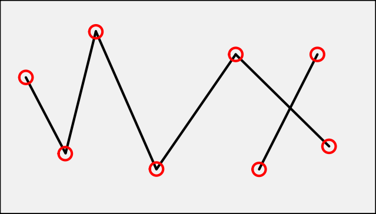

# 特征点检测与匹配
&emsp;&emsp;在**同时定位与建图**(SLAM)、**运动结构恢复**(SfM)、**相机校准**与**图像匹配**、**立体匹配**等几何计算机视觉任务中，首要的任务就是从图像检测出特征点。特征点一般由关键点和描述子组成，关键点是图像中的二维坐标，从不同的光照条件和视角下，这些位置应该是稳定且可复现的。描述子则是用于描述这些关键点的对应的高维特征编码向量，通过局部图像块的特征提取来获得的，要保证在不同图像下，相同特征点的描述是一致的。然而，特征点检测在现实世界的计算机系统中仍然面临着一些挑战，例如光照变化、大视角变化和遮挡等问题，这些都可能导致特征点的丢失或错误匹配。

## 何为角点

&emsp;&emsp;角点是图像中某些属性比较突出的像素点。常见的角点有以下几种：
* 灰度梯度的最大值对应的像素点
* 两条直线或者曲线的交点
* 一阶梯度的导数最大值和梯度方向变化率最大的像素点
* 一阶导数值最大，但是二阶导数值为0的像素点

## 何为关键点
&emsp;&emsp;关键点在宏观定义上与角点定义相同。在现实世界图像中，所谓的关键点不再是简单的直线或者曲线的交点。例如，一个圆盘可认为其中心是一个关键点，叶片的尖端是一个关键点。关键点主要属性，即是其在图像中的`[x, y]`坐标。

## 何为描述子
&emsp;&emsp;描述子是用来唯一描述关键点的高维编码，可以通过描述子可以区分两个不同的关键点，也可以在不同图像中寻找同一个关键点。好比是每个人的身份证信息，不同的人对应相应的身份号码。

## 何为特征点
&emsp;&emsp;特征点一般由关键点和描述子组成。

## 深度学习
&emsp;&emsp;深度学习主要学习特征点的关键点提取与描述子编码。

## 特征提取轻量网络
VGG
(ResNet是重型网络)

## 特征检测与匹配模型
* 稀疏关键点检测与匹配：SuperPoint、SuperGlue（SG）、LightGlue（LG）
* 半密集（局部全密集特征匹配）关键点检测与匹配：DRC-Net、LoFTR、EfficientLoFTR、四叉树注意力、MatchFormer、AspanFormer、TopicFM
* 全密集关键点检测与匹配：ROMA