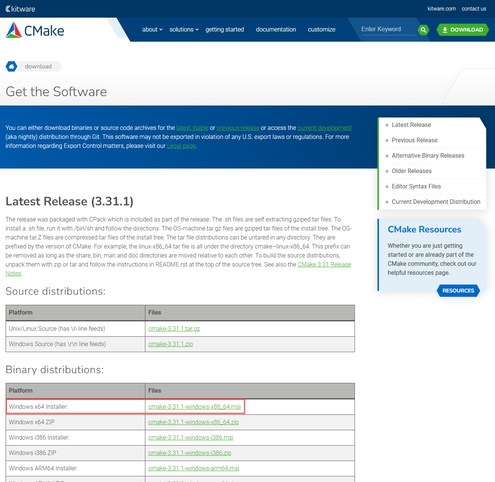
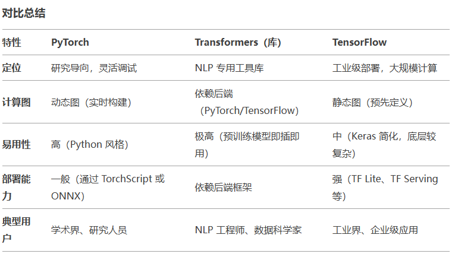
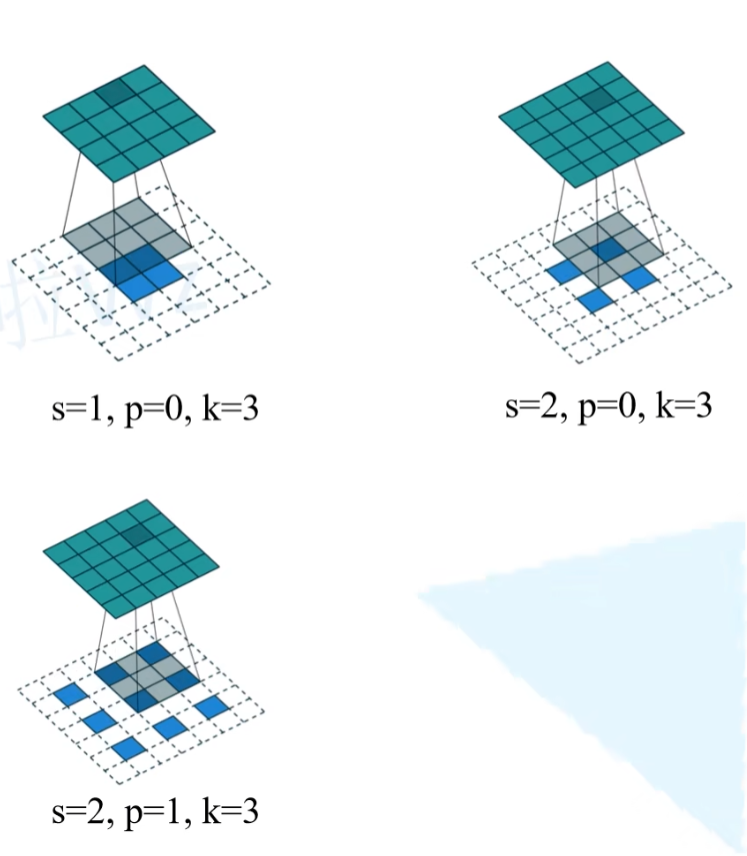
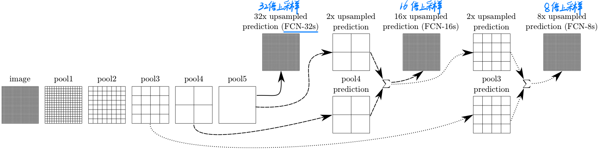
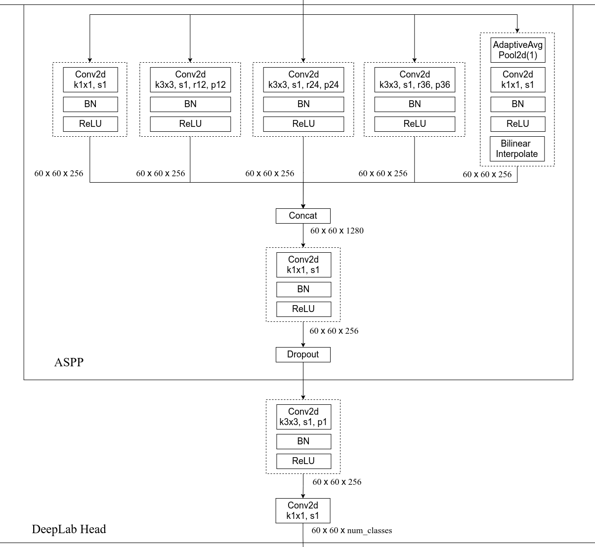

# 学习笔记

---
## OepnCV C语言环境安装
### C/C++
* 使用[Msys2](https://www.msys2.org/)，一个类似于Liunx内核的包管理系统。
可以按照官方教程安装`mingw-w64-ucrt-x86_64-gcc`，个人喜欢安装`mingw-w64-x86_64-gcc`。

* 初始化环境
	```bash
	pacman -Syu
	```

* 以下附上我所安装的所有包(**安装mingw-w64-x86_64-gcc工具链**)
	```bash
	pacman -S --needed base-devel mingw-w64-x86_64-toolchain mingw-w64-x86_64-cmake gcc gdb
	```
* 添加环境变量  


### 安装CMake
* 按照[CMake](https://cmake.org/download/)网站提供的msi文件安装  


### 安装OpenCV
&emsp;&emsp;此为C/C++语言环境安装OpenCV，首先打开CMake-gui。([可按照此篇文档进行安装](https://blog.csdn.net/SirClown/article/details/142614854))
&emsp;&emsp;需要注意的是，一定要勾选**BUILD_opencv_world**，它的作用是将所有库文件使用动态库链接的方式存储，方便后续设置环境变量只用设置一个文件夹。
&emsp;&emsp;编译源文件为下载的OpenCV整个源文件，而添加的*OPENCV_EXTRA_MODULES_PATH*为`opencv_contrib\modules`。
&emsp;&emsp;在编译完成后，需要在build文件夹中，使用cmd输入**mingw32-make**编译生成文件，最后使用**mingw32-make install**进行安装。
&emsp;&emsp;安装后的所有文件保存在`build\install`中，我们需要设置`\build\install\x64\mingw\bin`添加入环境变量中。

---
[CMake学习笔记](./CMake.md)
[ROS学习笔记](./ROS.md)
[SLAM学习笔记](./SLAM.md)
[Python学习笔记](./Python.md)
[特征检测与匹配](./Feature%20Point%20Detction%20and%20Matching.md)
[Attention](./Attention.md)
[端到端自动驾驶](./End-to-End%20Autonomous%20Driving.md)
[标定设备](./calibration.md)

---
## 关于PyCharm
&emsp;&emsp;`<2025.2.18>` 遇到很傻逼的问题，在cmd中使用pip install会根据系统安装到指定文件夹，而在PyCharm的命令行中使用pip install会安装到C盘的用户站中。建议以后都用cmd去安装python包。(当你不需要虚拟环境时)
&emsp;&emsp;解决方案:确定了是IDE的问题，进入IDE后会直接进入conda环境，而安装文件的路径也是conda的安装路径，在cmd中使用的是python的安装路径。如果不希望conda自动激活`base`环境，可以修改conda的配置：
1. 打开终端，运行以下命令：
   ```bash
   conda config --set auto_activate_base false
   ```
2. 重启终端或 IDE，Conda 将不再自动激活 base 环境。

---
## 关于Yolo
### 图像标注label
* 使用Yolo需要对数据集进行标注，常用的标注有`labelimg`、`labelme`、`label-studio`  
推荐使用conda建立虚拟环境后，在安装对应的标注工具
	```bash
	conda create -n label python=3.8
	```
  (安装python3.8是因为labelimg不支持高版本python，安装高版本python会导致闪退)
#### labelimg(国内安装)
&emsp;&emsp;labelimg仅支持使用矩阵预测框标记图片，但可以直接生成符合YOLO格式的txt文件，以及其余的CreateML格式、PascalVOC格式。  
&emsp;&emsp;改变生成格式在左侧栏的第8个按钮。
##### 安装
```bash
pip install labelimg
```
##### 使用
```bash
labelimg
```
#### labelme
&emsp;&emsp;相比于labelimg，labelme可以支持使用多边形预测框标记图片，且支持中文，还能使用AI模型进行快速标注(只是不用手标，不代表速度标注速度快，推荐使用`SagmentAnything(accuracy)`)。此标注工具非常适合`图像分割`(SAM，SegmentAnythingModel)。
##### 安装
```bash
pip install labelme
```
##### 使用
```bash
labelme
```
#### label-studio(未使用过)
&emsp;&emsp;一个通过本地网页的标注工具。需要注册账号。
##### 安装
```bash
pip install label-studio
```
##### 使用
```bash
label-studio
```
### 使用Yolo进行图像训练
#### 安装YOLO
```bash
pip install ultralytics
```
&emsp;&emsp;需要在`data`文件夹中编写数据文件，设定`path`、`train`、`val`、`test`、`number of classes`。可参考`coco128.yaml`设定，需要注意的是，在`coco128.yaml`中设定的是`path: ../datasets/coco128`，这是因为该数据文件会把图片和标签下载在`yolov5`项目外的文件夹。因此，我在`yolov5`项目里自己编写数据文件时，且将图片和标签放在`datasets`文件夹中，应该设定为`path: datasets/data_name`。 
&emsp;&emsp;同时，还需要修改`models/yolov5s.yaml`中的`nc`参数对应数据文件中的关键字。  
&emsp;&emsp;此外，非常建议，图片和标签按照7:2:1划分为训练集、验证集、测试集。

---
## 关于计算机视觉CV(Computer Vision)
* 信息理解:   
1. 图像分类:将图像分为不同的类别或者标签，是CV中最基础也是最常见的任务之一。  
2. 目标识别:在图像中定位并识别多个不同类别的物体。  
3. 语义分割:对图像中的每个像素进行分类，将图像分割成不同的语义区域。  
4. 实例分割:在语义分割的基础上，进一步区分不同物体实例。  

* 图像生成:  
1. 图像增强:图像增强是指对图像进行处理，以改善图像的质量、对比度、亮度或锐度等方面的特征。  
2. 风格迁移:将一幅图像的风格转移到另一幅图像上，从而创造出新的图像，融合了原始图像的内容和目标风格的特征。  
3. 文生图:根据文字描述生成新的图像。

---
## 关于自然语言
### 自然语言理解NLU(Natural Language Understanding)
* 信息理解:  
1. 文本分类:将文本按照一定的标准分类导不同的类别中，常见的应用包括情感分析、垃圾邮件过滤等。常见的模型包括朴素贝叶斯、支持向量机(SVM)、循环神经网络(RNN)、卷积神经网络(CNN)等。  
2. 命名实体识别:从文本中识别和分类出命名实体，如人名、地名、组织机构名等。常用的技术包括条件随机场、双向长短期记忆网络、BERT等。
文本生成:根据给定的文本生成新的文本，常见的技术包括循环神经网络(RNN)、长短期记忆网络(LSTM)、生成对抗网络(GAN)等。
### 自然语言处理NLP(Natural Language Processing)

### 自然语言生成NLG(Neural Language Generation)

---
## 关于机器学习
### 监督学习(函数逼近:回归、分类问题)
* 线性回归、逻辑回归
* 决策树、随机森林
* K近邻 K-NN(K-Nearest Neighbors)
* 支持向量机SVM
* 神经网络NN
  
### 非监督学习
* 聚类(K-Means算法)
* 降维
* 关联规则
* 异常检测

### 强化学习

---
## 关于深度学习

### 神经网络模型搭建
&emsp;&emsp;nn.Squential是一个序列容器，用于搭建神经网络的模块按照顺序添加到容器中，即将多个模块封装成一个模块。
* nn.Sequetial: 按顺序包装多个网络层
* nn.ModuleList: 按python的list一样包装多个网络层
* nn.ModuleDict: 按python的dict一样包装多个网络层

### 前方反馈网络

### 误差反向传播
&emsp;&emsp;由输出层误差推前一层误差，~~将复杂的求导过程通过拉格朗日多项式化为简单的减法过程~~。  
&emsp;&emsp;在残差网络ResNet发明之前，存在梯度爆炸和梯度消失。这是因为在计算过程中，由于误差反向传播后会乘后一层误差，当神经网络层数较大时，其误差也会成指数型增大或减少。

### 残差网络ResNet
&emsp;&emsp;**要点：超深的网络结构（突破1000层）；提出Residual模块；使用Batch Normalization加速训练（丢弃Dropout）**  
&emsp;&emsp;在残差网络ResNet发明之前，由于存在梯度爆炸和梯度消失，神经网络一直发展不起来。  
&emsp;&emsp;残差网络ResNet解决的问题，降低由于神经网络层较大时，直接使用残差网络将误差系数变小。  
&emsp;&emsp;1x1的卷积层是用于降维或者升维的。输入RGB图像，其维度为3。经过一层卷积层有256个卷积核之后，其维度变为256。1x1的卷积层在不改变特征矩阵的矩阵大小的情况下，对矩阵进行降维或者升维操作。  
&emsp;&emsp;BN层（Batch Normalization）用于调整特征层满足正态分布规律。

#### 跳跃连接 和 残差学习
* 跳跃连接：`torch.cat`。用于特征融合，其维度`channel`会发生变化，为`x1.ch + x2.ch`。
* 残差学习：`+`。输入输出直接相加，其维度`channel`不会发生变化，同时要保证`x1`，`x2`的维度，图像大小相同。

### CNN卷积和池化
&emsp;&emsp;主要目的：进行图像特征提取  
&emsp;&emsp;卷积特性：拥有局部感知机制、权值共享  
&emsp;&emsp;经卷积后的矩阵尺寸大小：$N = [(W-F+2P)/S]+1$ @W:输入图片 F:核大小 S:步长 P:填充像素 （/S向下取整）
1. **数据输入层**：去均值，将维度都中心化为0，其目的是把样本的中心拉回到坐标系原点上。归一化处理，减少各维度数据取值范围的差异而带来的干扰。
2. **卷积层**：设定多个卷积核，需要训练卷积核的参数。由于图像通常是3通道图像(RGB图像)，因此设定的卷积核也对各自的通道进行卷积操作(每个通道的卷积核可以不同)。每个卷积核都都是一个滤波器。在卷积层中，可以同时存在多个卷积核对其中的通道进行卷积。通过训练模型，卷积核最终会演化为能够检测图像中特定模式（如边缘、角点、颜色分布等）的特征提取器。图像的特征就是这样被提取出来的。
3. **激活层**：激活函数通常是非线性的，这样增加网络的深度才有意义，同时激活函数通常是可导的，这样才能进行梯度下降。常见的激活函数有，sigmoid函数、Tanh函数、**ReLU函数**、Leaky ReLU函数等。
4. **池化层**：无需训练，需要自己设定好参数(核大小、步长)。池化层的作用是下采样，缩小特征图尺寸，降维、去除冗余信息、对特征进行压缩、减少复杂度、减少计算量、减少内存消耗。
#### CNN卷积的局限性
CNN非常强大，但被**归纳偏置**限制，即模型被迫对数据做出的假设，对于CNN有以下的假设：局部性和平移不变性
认为图像中最重要的信息是局部的，相邻的像素之间关系最紧密
由上，则出现了以下的局限性：
* 感受野限制：本质上是滑动窗口，每个神经元只能看到这个小窗口内的局部信息，想要获得更大的感受野必须堆叠更深的网络，如果堆叠了深层的神经网络，必然会存在信息丢失
* 缺乏全局建模能力：CNN卷积只关注相邻像素之间的关系，缺乏关注全局图片的信息
* 模型拓展性差：它很难从小模型拓展到大模型，有提出ResNet网络架构能帮助CNN卷积拓展到更深层的方式，但最终效果会随着堆叠更深的神经网络，其效果提升越低，易遇到瓶颈，性价比降低迅速，而且ResNet在更深层表现为恒等映射，即输入和输出几乎相等，消耗资源但未提升模型能力
* 可迁移性弱：CNN的模型假设限制了模型能处理多方法的能力，例如目标检测模型不能进行特征点检测和图像分割

### 全连接层
&emsp;&emsp;主要目的：对图像特征提取后的特征进行分类

### BN层（BatchNorm）批量归一化处理
&emsp;&emsp;需对数据做归一化处理，使其分布一致。在深度神经网络训练过程中，通常一次训练是一个batch，而非全体数据。每个batch具有不同的分布产生了internal covarivate shift问题——在训练过程中，数据分布会发生变化，对下一层网络的学习带来困难。Batch Normalization将数据规范到均值为0，方差为1的分布上，一方面使得数据分布一致，另一方面避免梯度消失

### RNN循环神经网络
经典模型:LSTM(Super Max版RNN)

### GNN图神经网络

### GAN对抗生成网络

### VGG 
&emsp;&emsp;**要点：具有相同的感受野，同样提取了大卷积核的图像特征，且计算参数少**  
&emsp;&emsp;在卷积神经网络中，决定某一层输出结果中一个元素所对应的输入层的区域大小，被称作感受野。通俗的解释是，输出feature map上的一个单元对应输入层上的区域大小。  
&emsp;&emsp;通过堆叠多个3x3的卷积核来替代大尺度卷积核（减少所需参数）,通过堆叠两个3x3的卷积核来替代5x5的卷积核，三个3x3的卷积核来替代7x7的卷积核，具有相同的感受野。  
&emsp;&emsp;(例如，5x5x3的图像，使用两个3x3x3的卷积核，保证其维度相同，最终得到5x5x2的结果，在实际计算过程中，会用0填充边界，其次在由于使用两个卷积核则会得到两个维度)通过设定多个卷积核，可以提取多种特征，增加模型的表达能力，增强模型的鲁棒性。  
* VGG-16(说明有16层（不包括池化层），经过2层conv后池化，2层conv后池化，3层conv后池化，3层conv后池化，3层conv后池化，最后经过3层全连接层，共16层)  

### BackBone
&emsp;&emsp;现代模型可以在前人的基础上进行拼接得到，例如主干网络BackBone。它的作用是特征提取，从输入图像提取多层级的语义特征。
* 常用的主干网络BackBone有：`VGG-16`、`ResNet`、`Focus`。

### Pytorch 和 TensorFlow

* Pytorch Tensor
* 图像处理的常见通道排序:`[B, C, H, W]`
  batch(B)：一批图像的数量
  channel(C)：图像的深度（RGB图像有3个通道深度）
  height(H)：图像的高度
  width(W)：图像的宽度 

### 图像分类

### 目标检测
#### R-CNN（Region with CNN feature）
**pipeline：**
1. 一张图像生成1K~2K个候选区域（使用Selective Search方法）
2. 对每个候选区域，使用深度网络提取特征
3. 特征送入每一类的SVM分类器，判别是否属于该类
4. 使用回归器精细修正候选框位置
#### Fast R-CNN
**pipeline:**
1. 一张图像生成1K~2K个候选区域（使用Selective Search方法）
2. 将图片输入网络得到相应的特征图，将SS算法生成的候选框投影倒特征图上获得相应的特征矩阵
3. 将每个特征矩阵通过ROI　pooling层缩放倒7x7的特征图，接着 将特征图展平通过一系列全连接层得到预测结果

### 语义分割
#### 语义分割数据集格式
* PASCAL VOC：PNG图篇P格式
* MS COCO：针对图像中的每一个目标都记录了多边形坐标
#### 语义分割评价指标
* Pixel Accuracy（Global Acc）：衡量全局的像素分类正确率，但可能受类别不平衡影响
* mean Accuracy：对每个类别的准确率取平均，更关注每个类别的性能
* **mean IoU**：衡量预测与真实标签之间的重叠程度，是语义分割中最常用的评价指标
#### 转置卷积 与 双线性插值
&emsp;&emsp;转置卷积不是卷积的逆运算，转置卷积也是卷积。它能将2x2矩阵变换成4x4矩阵。

&emsp;&emsp;转置卷积的运算步骤：
* 在输入特征图元素间填充`s-1`行，列`0`
* 在输入特征图四周填充`k-p-1`行，列`0`
* 将卷积核参数旋转180°翻转
* 做正常的卷积运算  
&nbsp;
torch.nn.ConvTranspose2d图像矩阵计算公式  
$H_{out} = (H_{in}-1) * stride[0] - 2 * padding[0] + dilation[0] * (kernel\_size[0] - 1) + output\_padding[0] + 1$
$W_{out} = (W_{in}-1) * stride[1] - 2 * padding[1] + dilation[1] * (kernel\_size[1] - 1) + output\_padding[1] + 1$
* H、W：图像尺寸
* stride：采样间隔
* padding：输入图像的填充
* output_padding：输出图像的填充
* kernel_size：卷积核大小
* dilation：膨胀卷积和空洞卷积

#### 膨胀卷积dilation convolution
&emsp;&emsp;在**保持原输入特征图尺寸**的同时，增大感受野。建议使用在深层网络中

#### 全卷积网络FCN
&emsp;&emsp;将最后的全连接层替换成卷积层，实现像素级预测。卷积层具有平移不变性，且无规定的输入大小。下采样能减少计算量，但会丢失细节。

&emsp;&emsp;因此，经过pool5后进行上采样的FCN-32s模型准确率并不高；经过pool3后进行上采样并与之前图像融合后的FCN-8s模型准确率最高。

#### LargeFOV
&emsp;&emsp;核心思想：通过空洞卷积扩大感受野，覆盖更广的图像区域。单层大范围上下文捕获。  
&emsp;&emsp;将替换全连接的卷积层从`核大小7x7，步距4`降低为`核大小3x3，步距12`，它们具有相同的感受野，但降低后的训练参数变少，提升训练速度。

#### MSc(Multi-Scale)
&emsp;&emsp;核心思想：在不同分辨率或尺度下分析图像，捕捉不同层次的语义和细节信息。使用图像金字塔、特征自己他、空洞卷积多分支。多尺度特征融合。
#### MGc(Multi-Grid)
&emsp;&emsp;核心思想：在残差块中分层使用不同扩张率组合，扩大感受野的同时保持计算效率。分层扩大感受野。
#### CRF（Conditional Random Field，条件随机场）
&emsp;&emsp;核心思想：基于像素间空间关系优化分割结果，提升边界精度。优化分割边界。
#### ASPP模块

&emsp;&emsp;核心思想：并行多分支结构捕获多尺度上下文信息。并行多尺度上下文建模。  
&emsp;&emsp;ASPP模块用于多尺度特征提取的关键部分。ASPP应该包含多个并行的卷积层，每个卷积层有不同的膨胀率（dilation rate），这样可以捕获不同尺度的上下文信息。此外，还有一个全局平均池化层，用于捕捉图像级别的特征，最后将所有分支的特征拼接起来，再通过一个投影层得到最终的输出。  

### 实例分割

### 关键点检测

### 训练方式
#### 特征图预处理方法
训练的预处理方法，对特征图进行缩放、平移、旋转、翻转等操作，得到多个多样性图片
#### 优化器超参数
* 学习率(Learning Rate):控制每次参数更新的步长
* 动量 (Momentum):加速收敛并减少震荡;保留前次更新方向的部分惯性
* 权重衰减 (Weight Decay / L2正则化):防止过拟合，约束参数幅度
#### 学习率衰减策略
* 热身训练:适合初期,将学习率降低再逐步恢复正常
* 阶梯衰减:适合在学习末期，在特定迭代次数，进行学习率衰减，防止模型过拟合
* 余弦退火:周期性重置学习率
#### 早停机制
当损失函数的loss值减少较少时，停止训练
#### 恢复机制 
当出现特殊情况而停止训练后，使用恢复机制继续训练模型，继续迭代
#### 训练参数[总样本数 N] → [Batch Size B] → [Iterations per Epoch = N/B] → [Epochs E]
* 样本(Sample):单个训练数据单元
* 批大小(Batch Size):每次输入模型的样本数量[Tensor的通道排序:`[batch, channel, height, width]`中的`batch`即Batch Size]
* 迭代次数(Iteration):完成一次模型参数更新所需的批次处理次数
* 训练轮次(epoch):完整遍历一次训练集的过程,小训练集多次训练能防止欠拟合

### model.train() VS model.eval() VS torch.no_grad()
* model.train():设置模型为训练模式
1. 训练模式中，BatchNorm 会计算当前批次的均值和方差，并更新运行均值（running mean）和方差（running variance）
2. 训练模式中，Dropout 会随机将部分神经元置零，以防止过拟合
* model.eval():设置模型为评价模式
1. 评价模式中，BatchNorm 使用之前累积的运行均值和方差，不再更新
2. 评价模式中，Dropout 被禁用，所有神经元都会参与计算
* torch.no_grad()
禁用梯度更新，一般使用在 *model.eval()* 阶段中。用于节省内存和计算资源。

### 损失函数
#### 分类损失函数
#### 回归损失函数
* L1范数损失 **l1_loss**
* **huber_loss**
* 平滑版L1损失 **smooth_l1_loss**
* 均方误差损失 **mse_loss**
* **margin_ranking_loss**
* **hinge_embedding_loss**
* **multilabel_margin_loss**
* **soft_margin_loss**
* **multilabel_soft_margin_loss**
* **cosine_embedding_loss**
* **multi_margin_loss**
* 交叉熵损失 **cross_entropy** :当训练有 C 个类别的分类问题时很有效. 可选参数 weight 必须是一个1维 Tensor, 权重将被分配给各个类别. 对于不平衡的训练集非常有效。
* 二进制交叉熵损失 **binary_cross_entropy** :二分类任务时的交叉熵计算函数。用于测量重构的误差, 例如自动编码机. 注意目标的值 t[i] 的范围为0到1之间.
* 带有 Logits 的二元交叉熵 **binary_cross_entropy_with_logits** :BCEWithLogitsLoss损失函数把 Sigmoid 层集成到了 BCELoss 类中. 该版比用一个简单的 Sigmoid 层和 BCELoss 在数值上更稳定, 因为把这两个操作合并为一个层之后, 可以利用 log-sum-exp 的 技巧来实现数值稳定.
* 散度损失 **kl_div** :KL 散度可用于衡量不同的连续分布之间的距离, 在连续的输出分布的空间上(离散采样)上进行直接回归时 很有效。
* 连接时序分类损失 **ctc_loss** :可以对没有对齐的数据进行自动对齐，主要用在没有事先对齐的序列化数据训练上。比如语音识别、ocr识别等。
* 负对数似然损失 **nll_loss** :用于训练 C 个类别的分类问题。
* 目标值为泊松分布的负对数似然损失 **poisson_nll_loss**
* 目标值为高斯分布的负对数似然损失 **gaussian_nll_loss**

---
## 关于大模型微调技术
### 全量微调 VS LoRA微调

---
## 开源协议
* GPL:强制开源。强制代码开源和强制免费分享。你使用GPL协议的代码库，必须开源出去。
* LGPL:可以绕过开源。如果使用动态链接的方式去使用代码库，可以闭源；如果使用静态链接的方式去使用代码库，必须开源。
* MIT:可以闭源。可以任意复制修改，商业贩卖。只要遵循MIT协议即可。
* BSD:不能碰瓷。与MIT协议相似，只增加一条——**不能使用以前的人的名气去宣传**。
* Apache:建设法制社会。保持宽松的开源基础上，增加一些**避免法律纠纷**的条款。例如，你使用代码库不用担心专利授权的问题；在涉及到别人的商标的问题，你是不能使用的。
* WTFPL:自由。随便使用代码，修改代码，甚至更改后续的开源协议(*你想做什么就做什么*)。这是官方认可的开源协议。